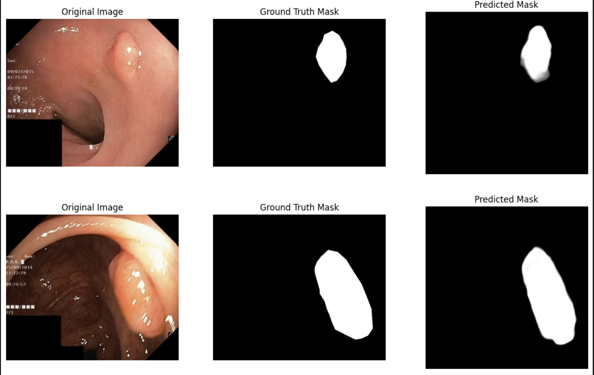

# Semantic-Segmentation_Gastrointestinal-Tract-Polyp

This repository contains code for Gastrointestinal (GI) tract polyp segmentation.

## Workflow

**1. Dataset details:** The Kvasir-SEG dataset contains 1000 polyp images and their corresponding ground truth from the Kvasir Dataset v2. The resolution of the images contained in Kvasir-SEG varies from 332x487 to 1920x1072 pixels. The images and its corresponding masks are stored in two separate folders with the same filename. The image files are encoded using JPEG compression, and online browsing is facilitated. The open-access dataset can be easily downloaded for research and educational purposes. The bounding box (coordinate points) for the corresponding images are stored in a JSON file. This dataset is designed to push the state of the art solution for the polyp detection task.

**2. EDA:**: After loading the dataset, I have observed that there are 1000 images and 1000 masks images which reprenst the polyp. I plotted the image and corresponding mask together and understood that I have to classify each pixel in an image into one of two classes: foreground (polyp) or background. I also checked whether the mask image is in grayscale or not.

**3. Data Processing:**: For creating a data preprocessing pipeline, I defined a custom SegmentationDataset class that loads images and masks, applies data augmentations for training, and ensures compatibility with PyTorch tensors. For training data, I performed a series of transformations, including flips, color jitter, affine transformations, and resizing, followed by conversion to tensors and normalization. Validation and test datasets have their own set of resizing, tensor conversion, and normalization transformations. I split the data into training, validation, and test sets, creating data loaders for each split to facilitate batch loading and shuffling during model training and evaluation. These preprocessing steps are essential for preparing the data for binary pixel-wise segmentation tasks.

**4. Segmentation pipeline creation and training:** I used the UNet++ architecture with an EfficientNet-B2 encoder. The model is configured for binary segmentation, where each pixel in the input image is classified as either foreground or background. The EfficientNet-B2 encoder, pretrained on ImageNet, is employed to extract features from the input images. I used sigmoid activation, Foccal loss as the loss function, adam optimizer with learning rate of 0.001. The code employs callbacks to save the model's progress and training metrics and monitors the validation Dice score for checkpointing. Additionally, evaluation metrics, such as the Dice coefficient and Intersection over Union (IoU), are computed to assess the model's performance. The model is trained for 50 epochs, with detailed training and validation logs recorded for analysis. I used poutyne framework for creating the segmentation pipline.

**5. Model Evaluation:** For testing the model, I loaded best weights (which had the highest val dice score) from the checkpoint into the model and then performed evaluation on testloader. For evaluation I used the following metrics:

- Dice Coefficient (Dice): It is also known as F1 score. It is a commonly used metric for evaluating the accuracy of image segmentation models. It measures the similarity or overlap between the predicted segmentation mask and the ground truth mask.The Dice coefficient ranges from 0 (no overlap) to 1 (perfect overlap), with higher values indicating better segmentation performance.

Dice = (2 \* |A ∩ B|) / (|A| + |B|)

Where:
|A ∩ B| represents the area of the intersection of sets A and B (number of overlapping pixels between the prediction and ground truth)
(|A| + |B|) represents the total number of pixels in both masks(prediction and ground truth).

In the context of binary classification, the equation can also be expressed as:

Dice = (2 _ TP) / ((2 _ TP) + FP + FN)

- Jaccard Index (IoU - Intersection over Union): It is another widely used metric for measuring the accuracy of segmentation models. It calculates the ratio of the intersection of the predicted and ground truth masks to their union. Similar to the Dice coefficient, the IoU metric also ranges from 0 to 1, with higher values indicating better segmentation accuracy.

Jaccard Index = |A ∩ B| / |A ∪ B|

Where:
|A ∩ B| represents the cardinality (size) of the intersection of sets A and B.
|A ∪ B| represents the cardinality (size) of the union of sets A and B.

In the context of binary classification, the equation can also be expressed as:

Jaccard Index = TP / (TP + FP + FN)

Higher Dice coefficients and IoU values indicate that the model is effectively segmenting objects of interest in the images. These metrics provide quantitative measures of the model's accuracy and help in assessing its ability to perform binary pixel-wise segmentation.

**7. Result:**

| Model  | Dice Coefficient | Jaccard Index(IOU) |
| ------ | ---------------- | ------------------ |
| UNet++ | 0.907919         | 0.831366           |

## Conclusion:

In conclusion, this project involves the development of a binary pixel-wise segmentation model for a medical imaging task using the Kvasir-Segmentation dataset. The task aims to segment specific regions of interest within endoscopy images, which is crucial for medical diagnosis and treatment planning.
